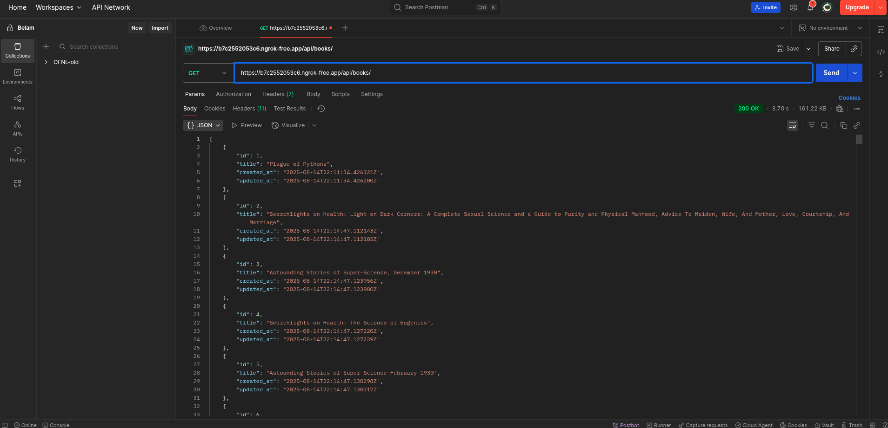

# Books API

This Django REST Framework project exposes a simple API to list books with optional offset-based pagination.

## Screenshots




## Endpoints

### List all books (no pagination)

```
GET /api/books/
```

**Response example:**

```json
[
    { "id": 1, "title": "Book 1"... },
    { "id": 2, "title": "Book 2"...},
    ...
]
```

### Paginated list of books (offset-based)

```
GET /api/books/paginated/?pg=<page>&limit=<items_per_page>
```

**Query Parameters:**

* `pg`: page number (default 1)
* `limit`: number of items per page (default 20, max 50)

**Response example:**

```json
{
    "page": 2,
    "limit": 20,
    "total_items": 123,
    "total_pages": 7,
    "next_page": 3,
    "previous_page": 1,
    "results": [
        { "id": 21, "title": "Book 21", "author": "Author A" },
        { "id": 22, "title": "Book 22", "author": "Author B" }
    ]
}
```

## Testing in Postman

1. Start Django server:

```bash
python manage.py runserver
```

2. Create a new GET request in Postman:

```
http://127.0.0.1:8000/api/books/paginated/?pg=2&limit=20
```

3. Adjust `pg` and `limit` to test different pages.
4. Validate that `next_page`, `previous_page`, and `results` behave correctly.

## Notes

* Pagination uses **offset-based slicing** (`start = (pg-1)*limit`).
* Returns **metadata** about total items, pages, and navigation.
* Original `ListBooksView` remains available for full list access.

---

## Next Steps

* Learn **cursor-based pagination** for more efficient navigation through large datasets.
